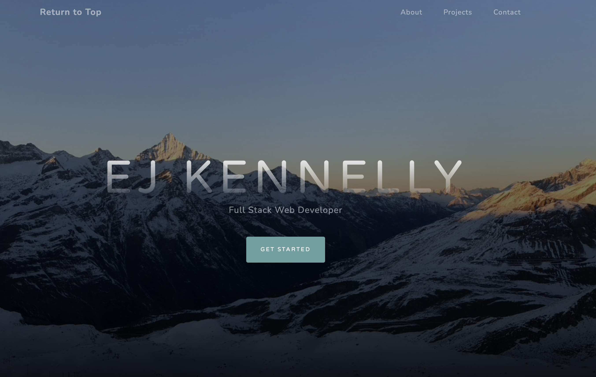

# Portfolio 
## Description
Personal portfolio page to highlight my projects and provide links to my linkedin, resume, and github in one easy to navigate space.
## Table of Contents
* [Deployed Site](#link)
* [Questions](#questions)

## License
MIT

## Questions
[Link to my Github](https://github.com/ejkennelly)

Contact email address if you have additional questions: elizakennelly@gmail.com

## Link
Here is a [link](https://ejkennelly.github.io/Portfolio/) to my responsive portfolio!

